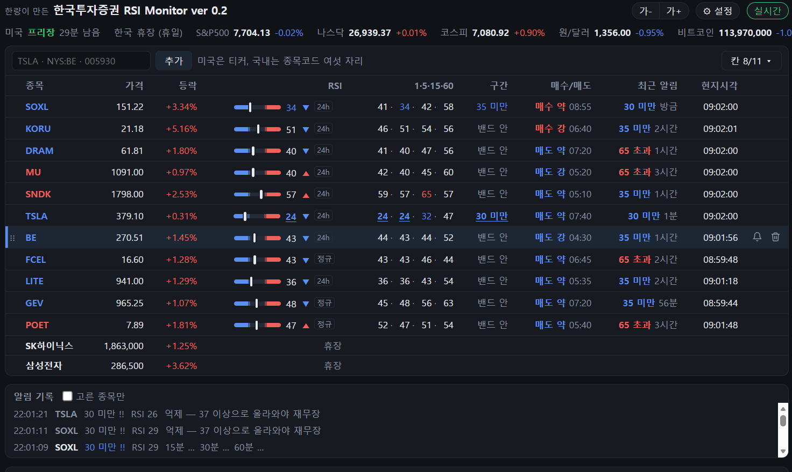

# KoreaInvestment RSI Monitor

**한국투자증권 Open API 로 미국·국내 주식 분봉과 실시간 체결가를 받아서, RSI 와 MACD 를 실시간으로 보여준다.**

<sub>Live RSI and MACD for US and Korean stocks, computed from Korea Investment & Securities (KIS) Open API minute bars and trade feed. Korean UI.</sub>

> 한국투자증권과 관계없는 개인 프로젝트다. 한국투자증권이 만들거나 확인한 프로그램이 아니며,
> 한국투자증권 Open API 를 쓸 뿐이다. 투자 판단과 그 결과는 쓰는 사람의 몫이다.



- **1단계 (됨)** — 분봉과 실시간 체결가로 RSI·MACD 를 계산해서 웹 화면에 보여준다.
- **2단계 (됨)** — [webull_rsi_monitor](https://github.com/destory1984/webull_rsi_monitor) 처럼 선을 넘으면 알린다.
  소리(TTS)와 텔레그램 둘 다 된다. 매수·매도 시그널, 종목별 RSI 선, 알림 뒤 결과도 있다.
- **3단계 (하는 중)** — 알림이 쓸 만한지 숫자로 본다. 지난 분봉을 되감아 채점하고(`kis_replay.py`),
  그것을 보고 선과 시그널 규칙을 고친다.

---

## 왜 만들었나

RSI를 대신 보고 있다가, 적당한 임계를 넘으면 내게 예쁜 목소리로 알려주는 비서가 필요했다.

## 시작하기

### 1. 한국투자증권 키 받기

1. 한국투자증권 계좌를 만든다. 미국 주식을 보려면 한국투자증권 앱에서 **해외주식 거래 신청**도 해 둔다.
2. [KIS Developers](https://apiportal.koreainvestment.com/) 에 들어가 Open API 서비스를 신청하고
   **실전투자** 앱키(App Key)와 시크릿(App Secret)을 받는다. 이 프로그램은 실전투자 주소로만 붙는다.

### 2. 받아서 설치하기

Windows 에 Python 3.11 이상이 있어야 한다.

```bash
git clone https://github.com/destory1984/koreainvestment_rsi_monitor.git
cd koreainvestment_rsi_monitor
pip install -r requirements.txt
```

### 3. 키 넣기

```bash
python kis_rsi.py setup
```

앱키와 시크릿을 물어본다. 토큰을 한 번 받아 보고 맞으면 이 폴더의 `kis_config.json` 에 적는다.
이 파일은 `.gitignore` 에 들어 있어 저장소에 올라가지 않는다. 환경변수 `KIS_APPKEY`, `KIS_APPSECRET` 로 줘도 된다.

### 4. 띄우기

```bash
python kis_web.py TSLA SOXL 005930
```

브라우저가 저절로 http://localhost:8000 을 연다. 다음부터는 종목 없이 `python kis_web.py` 만 하면
저장된 목록으로 뜬다.

끌 때는 띄운 창에서 Ctrl+C, 또는 어느 창에서든 `python kis_web.py --stop` (포트 8000 을 듣는 서버를 찾아 끈다.
아래 자동 시작으로 창 없이 뜬 서버도 이것으로 끈다).

### 자동으로 띄우기 (고르기)

윈도우에 로그인하면 창 없이 서버를 띄우게 작업 스케줄러에 걸어 둘 수 있다. PowerShell 에서:

```powershell
$t = New-ScheduledTaskTrigger -AtLogOn -User "$env:USERDOMAIN\$env:USERNAME"; $t.Delay = "PT30S"
$a = New-ScheduledTaskAction -Execute "$env:LOCALAPPDATA\Microsoft\WindowsApps\pythonw.exe" `
       -Argument 'kis_web.py --no-browser --log kis_web.log' -WorkingDirectory "C:\_c\koreainvest"
$s = New-ScheduledTaskSettingsSet -StartWhenAvailable -ExecutionTimeLimit ([TimeSpan]::Zero) `
       -RestartCount 3 -RestartInterval (New-TimeSpan -Minutes 1) -MultipleInstances IgnoreNew
Register-ScheduledTask -TaskName "KIS RSI 모니터" -Trigger $t -Action $a -Settings $s
```

- 경로와 `pythonw.exe` 자리는 자기 것으로 바꾼다. 창이 없으니 찍는 것은 `kis_web.log` 에 쌓인다 (5MB 를 넘으면 `.old` 로 넘긴다).
- 키를 환경변수나 `kis_config.json` 에서 못 찾으면 `~/.bashrc` 의 `export KIS_APPKEY=...` 줄을 읽는다
  (작업 스케줄러로 뜨면 셸을 거치지 않아서다).
- **이미 떠 있으면 새로 띄우지 않고 끝난다.** 앱키 하나에 실시간 연결은 하나라 둘이 뜨면 서로 끊기 때문이다.
  손으로 `python kis_web.py` 를 해도 마찬가지로, 떠 있는 서버 쪽으로 브라우저만 연다.
- 끄기 `python kis_web.py --stop` 또는 `Stop-ScheduledTask -TaskName "KIS RSI 모니터"`, 지금 띄우기 `Start-ScheduledTask -TaskName "KIS RSI 모니터"`,
  아예 지우기 `Unregister-ScheduledTask -TaskName "KIS RSI 모니터"`.

### 5. 목소리 (따로 할 것 없음)

알림 목소리는 있는 것 가운데 가장 좋은 것을 저절로 고른다. 2번을 선택하면, 따로 할건 없다.

| 차례 | 목소리 | 필요한 것 |
|---|---|---|
| 1 | 로컬 TTS (Qwen3-TTS 1.7B, 화자 Sohee) | NVIDIA GPU 와 아래 서버. 조금 더 자연스러운 "무료" 목소리 |
| 2 | **Edge 음성** (ko-KR-SunHiNeural, 빠르기 +20%) | 인터넷만. `requirements.txt` 로 이미 깔린다. **대부분은 이것을 쓰면 된다** |

켜면 어느 목소리를 쓰는지 첫 줄에 찍는다(`알림 목소리: Edge 음성 …`). 알림 문장은 켤 때와 종목을 더할 때
미리 wave 파일로 만들어서 `tts_cache/` 에 쌓아 두고, 그 뒤로는 파일만 튼다.

Edge 음성은 Microsoft Edge 브라우저의 「소리 내어 읽기」가 쓰는 음성을 빌려 쓰는 것이라(`edge-tts` 꾸러미),
정식 서비스가 아니어서 언젠가 막힐 수도 있다. 막히면 윈도우에 들어 있는 TTS로 읽는다.

**로컬 TTS 를 쓰려면** — NVIDIA GPU 에 VRAM 이 8GB 남짓 비어 있어야 한다. 모델(약 4.3GB)은 처음 켤 때
Hugging Face 에서 저절로 받는다. 공개 모델이라 토큰은 필요 없다.
필자처럼 사람 목소리에 예민한 사람만 로컬 TTS 를 쓰면 된다. 대부분은 그냥 Edge 음성을 쓰면 된다.

```bash
python -m venv .venv_tts
.venv_tts/Scripts/pip install torch torchaudio --index-url https://download.pytorch.org/whl/cu124
.venv_tts/Scripts/pip install qwen-tts soundfile
.venv_tts/Scripts/python tts_server.py
```

`torchaudio` 를 `torch` 와 같이 먼저 까는 것이 중요하다. 빼먹으면 `qwen-tts` 가 PyPI 의 최신 `torchaudio` 를
끌어와 `torch` 와 짝이 안 맞고, 서버가 `WinError 127` 로 죽는다. 그랬다면
`.venv_tts/Scripts/pip install torchaudio==<torch 와 같은 버전> --index-url https://download.pytorch.org/whl/cu124`.

`준비됨: http://127.0.0.1:47650` 이 나오면 된 것이다.

**늘 띄워 둘 필요는 없다.** 한 번 만든 문장은 `tts_cache/` 에 파일로 남고 웹 서버는 그 파일만 튼다.
그래서 종목을 더했거나 읽는 법을 바꿨을 때만 이것으로 녹음하면 된다. 서버를 잠깐 띄워 없는 문장만 만들고 내린다:

```bash
python tts_make.py              # 종목 목록의 알림 문장 가운데 로컬 목소리가 없는 것만 (Edge 로만 있던 것도 바꾼다)
python tts_make.py --redo BE    # BE 문장은 있어도 다시
python tts_make.py --dry-run    # 만들 문장만 보기
```

읽는 법(`kis_alert.py` 의 `TTS_SAY_AS`)을 바꿨다면 웹 서버도 다시 켜야 새 문장으로 읽는다.

## 인터넷에 띄우지 않는 이유

이 화면을 서버 하나에 띄워 두고 여러 사람이 들어와 보게 할 수도 있다. 기술로는 어렵지 않다.
그래도 그렇게 하지 않고 각자 자기 키로 돌리게 했다. 이유는

1. **남에게 증권사 시세를 보여 주면 안 된다.** 한국투자증권 Open API 는 계좌 주인이 자기 투자에 쓰라고 주는 것이다.
   받은 시세를 다른 사람에게 보여 주는 건 약관으로 막혀 있다. 거래소(나스닥·NYSE·KRX)의
   실시간 시세를 남에게 보여 주려면 원래 따로 돈을 내고 재배포 계약을 맺어야 한다. 몇 사람만 보는
   작은 사이트라도 마찬가지다.

같은 집 안에서 휴대폰으로 보는 것은 `--host 0.0.0.0` 으로 된다(아래 참고).

## 쓰는 법

### 웹 화면

```bash
python kis_web.py TSLA SOXL 005930      # 처음 한 번 종목을 적어 띄운다
python kis_web.py                       # 다음부터는 저장된 목록으로 뜬다
```

브라우저에서 http://localhost:8000 을 연다. 위에는 종목 표, 아래에는 고른 종목의 5분봉 차트와
RSI·MACD 가 나온다. 표에서 종목을 누르면 차트가 바뀐다. 값은 체결이 올 때마다 0.5초 간격으로 고쳐진다.
차트는 켤 때 받은 봉에 DB 에 쌓인 지난 5일 치를 이어 붙여 며칠 뒤까지 넘겨 볼 수 있다 (`kis_web.py` 의 `HISTORY_DAYS`).

**표와 차트**

- **지수 띠** — 제목 아래 한 줄에 S&P500 · 나스닥 종합 · 코스피 · 원/달러 · 비트코인 · 니케이의
  값과 등락률을 보여 준다. 지수는 실시간으로 밀어 주는 통로가 없어 10초마다 묻는다. 비트코인은
  한국투자증권에 없어서 업비트 공개 시세(원화, 키 없음)를 쓴다. 다우존스는 한국투자증권 코드를 찾지 못해 뺐다.
  맨 앞에는 미국·한국 장 상태(주간거래·프리장·정규장·애프터·휴장 / 장전·정규장·장후 시간외·장 마감)와 남은 시간이 나온다.
- **휴장** — 공휴일에는 장 상태가 「휴장 (휴일)」이다. 장이 없는 날(주말·휴일)에는 그 시장 종목 줄에 이름·가격·등락만 두고
  「휴장」이라 쓰며, 알림·시그널도 보지 않는다. 국내 휴장일은 한국투자증권에 하루 한 번 묻고(`kis_holidays.json`),
  미국 휴장일은 `holidays` 꾸러미가 뉴욕증권거래소 규칙으로 해마다 셈한다.
  13시에 일찍 닫는 날(7/3, 추수감사절 다음 날, 12/24)은 규칙으로 따로 셈해 「정규장 (13시 조기 마감)」으로 보인다.
- **종목 더하기·빼기** — 표 위 칸에 적고 추가를 누른다. 미국은 `TSLA`, 거래소를 정하려면 `NYS:BE`,
  국내는 종목코드 여섯 자리(`005930`)다. 줄에 마우스를 올리면 오른쪽 끝에 휴지통이 나온다.
  왼쪽 끝 손잡이(⋮⋮)를 끌면 줄 차례가 바뀐다. 목록은 `kis_watchlist.json` 에 저장돼서 서버를 다시 켜도 남는다. 40개까지 된다.
- **보이는 칸·글자 크기** — 표 오른쪽 위 「칸 ▾」에서 보일 칸을 고르고, 위의 「가-」「가+」로 글자를 9~18px 사이에서 바꾼다.
  둘 다 그 브라우저에만 기억돼서 PC 와 휴대폰을 따로 맞출 수 있다.
- **여러 시간봉 RSI** — 「1·5·15·60」 칸에 1분·5분·15분·60분봉 RSI 를 나란히 보인다. 색은 RSI 칸과 같다.
  5분봉 과매도가 60분봉에서도 그런지 한눈에 본다. 알림·시그널은 5분봉으로만 낸다. 켤 때 5분봉을 먼저 받아
  화면을 띄우고 나머지 시간봉은 뒤에서 받으니, 켜고 몇십 초는 「-」로 보일 수 있다. 오버나이트 봉은 「24h」·「정규」를 따른다.
- **RSI 옆 ▲▼** — 앞 봉이 닫힐 때의 RSI 보다 0.05 넘게 오르면 ▲, 내리면 ▼ 다. 종목 이름도 같은 색이다.

**알림**

- **선 알림 (소리)** — RSI 가 35/65 를 넘으면 말머리 소리(땡) 뒤에 「테슬라 65 초과」, 30/70 을 넘으면
  세 음 경보 뒤에 「테슬라 70 초과」를 읽는다. 알림은 서버가 판정하고 이 PC 스피커로 내니 브라우저를
  닫아도 울린다. 한 번 울리면 선에서 7 만큼 되돌아오기 전에는, 그리고 10분 안에는 같은 알림을 다시 내지 않는다.
  규칙과 목소리는 [webull_rsi_monitor](https://github.com/destory1984/webull_rsi_monitor) 와 같다 (`kis_alert.py`).
  소리는 Windows 에서만 난다.
- **매수·매도 시그널** — 봉이 닫힐 때마다 본다 (`kis_signal.py`). RSI 가 35 이하(65 이상)로 가면 12봉 동안 매수(매도)
  쪽을 무장하고, 그동안 닫힌 봉의 RSI 가 선 안으로 돌아오면(35 위로 / 65 밑으로) 시그널을 낸다. 무장 중 RSI 가 30/70 까지
  갔으면 「강」, 아니면 「약」이다. 봉 안 RSI 최저·최고는 봉의 저가·고가로 정확히 계산한다.
  표의 「매수/매도」 칸에 마지막 시그널과 그 봉 시각이, 차트에는 ▲매수 ▼매도 가 붙고, 「테슬라 매수 시그널」처럼 말로도 알린다.
  처음에는 webull_rsi_monitor 의 `rsi_signal.py` 처럼 「MACD 히스토그램 부호가 바뀔 때」 냈는데, 꼭대기·바닥에서
  30분(중앙값)쯤 늦어 2026-09-25 에 바꿨다. 쌓인 분봉으로 견주면 5분쯤으로 빨라지고 60분 뒤 맞음은 비슷하다 (둘 다 50% 언저리).
- **종목별 RSI 선** — 표의 「구간」 칸을 누르면 그 종목 선 넷(강한 아래·아래·위·강한 위)을 바꾼다. 변동이 큰 3배 ETF 를
  20·25·75·80 으로 두는 식이다. 바꾼 종목은 「구간」 칸에 「25/75」 처럼 보이고 RSI 색·막대·차트 선·알림·시그널이 그 선을 따른다.
  「기본」을 누르면 30·35·65·70 으로 돌아간다. 설정 `lines` 에 남는다. 되감기에서 `--lines 25,75` 로 미리 견줘 볼 수 있다.
- **소리 끄고 켜기** — 「⚙ 설정」에서:
  - 「RSI 선 알림」 — 소리를 모두 끄고 켠다 (끄면 시그널 소리도 안 난다). 꺼져 있으면 설정 버튼에 🔇 가 붙는다.
  - 「매수·매도 시그널」 — 시그널 소리만.
  - 「소리 나는 때」 — 미국 주간거래·프리장·정규장·애프터·국내 종목마다, 그리고 「조용한 시각」(이 PC 시각,
    23:00~07:00 처럼 자정을 넘어도 된다).
  - 「TTS 테스트」 — 한 번 들어 본다.
  - 「알림 목소리 Edge」 — 켜면 알림·시그널을 로컬 TTS 녹음 대신 Edge 음성으로 읽는다 (없는 문장은 뒤에서 만든다, 바로 적용).
    인터넷이 끊겨 Edge 로 못 만들면 로컬 녹음을 쓴다. 시작 인사는 그대로. 설정 `tts_engine`.
  - 「목소리 크기」 — 알림·인사 목소리만 1~6배로 키운다 (말머리 소리·다른 프로그램은 그대로, 바로 적용). 설정 `tts_gain`.
  - 「국내 넥스트레이드」 — 켜면 국내 종목을 KRX 만이 아닌 통합 시세(KRX + 넥스트레이드)로 받는다. 실시간(H0UNCNT0)·분봉·시간(08:00~20:00)이
    같이 바뀌어 프리마켓·애프터마켓에도 값이 움직이고 RSI 도 그 봉으로 셈한다. 서버를 다시 켜야 적용된다 (설정 `kr_market`).

  한 종목만 조용히 하려면 그 줄 끝의 종 단추를 누른다. 이름 앞에 🔇 가 붙고, 🔇 를 누르면 다시 켠다.
  가린 알림도 기록에는 🔇 와 까닭이 함께 쌓인다.
- **텔레그램** — 알림·시그널을 폰으로도 받는다. 「🔴 TSLA 65 초과 · RSI 66.2 · $412.30」 처럼.
  봇 토큰·대화방은 환경변수 `TELEGRAM_BOT_TOKEN` / `TELEGRAM_CHAT_ID` (Webull 판을 쓰며 넣어 둔 것이 그대로 쓰인다)
  또는 `python kis_telegram.py setup` (토큰을 넣고 봇에게 말을 걸면 대화방을 찾아 `kis_config.json` 에 적는다).
  「⚙ 설정」의 「텔레그램」으로 끄고 켜고 「보내 보기」로 시험한다. 소리를 가린 알림은 알림음 없이 간다.
- **알림 기록** — 울린 알림과 억제된 알림이 표 아래 「알림 기록」에 쌓이고 `kis_alerts.jsonl` 에 남아
  서버를 다시 켜도 보인다. 「고른 종목만」을 켜면 차트에 띄운 종목 것만 보인다.
  표의 「구간」은 지금 RSI 가 어느 선 밖인지, 「최근 알림」은 그 종목에서 마지막으로 울린 알림과 지난 시간이다.
  차트에는 알림이 난 봉에 표시가 붙는다 (초과는 봉 위 ▼, 미만은 봉 아래 ▲).
- **알림 뒤 결과** — 알림 기록의 줄마다 「15분 +0.42% 30분 −0.13% 60분 …」처럼 그 뒤 가격이 붙는다.
  알림 때 가격에서 15·30·60분 뒤 5분봉 종가까지이고, 알림이 말한 쪽(미만·매수는 오름, 초과·매도는 내림)으로 갔으면 + (초록)다.
  「…」은 아직, 「—」은 그사이 장이 닫혀 못 본 것. 억제된 알림과 켤 때 이미 넘어 있던 알림에는 붙지 않는다.
- **성적** — 「알림 기록」 옆 「성적」을 누르면 실제로 울린 알림을 종류별(35 미만, 70 초과, 매수 강 …)로 모아
  15·30·60분 뒤 건수·맞음(보합 뺌)·평균을 보인다. 알림 기록 전체로 셈하니 날이 갈수록 쌓인다.
  「고른 종목만」을 켜면 그 종목만. 되감기 채점은 규칙을 흉내 낸 것이고 이것은 진짜로 울린 것이다.
- **목소리** — 로컬 TTS 가 있으면 그것, 없으면 Edge 음성을 쓴다 ([5. 목소리](#5-목소리-따로-할-것-없음)).
  로컬 TTS 서버 주소가 다르면 환경변수 `KIS_TTS_URL` 로 준다. 캐시 파일 이름이 webull_rsi_monitor 와
  같은 규칙이라, `--tts-cache` 로 그쪽 `tts_cache` 를 주면 만들어 둔 소리를 같이 쓴다.
- **시작 인사** — 켤 때 「모니터링을 시작합니다」라고 한다. `kis_settings.json` 에
  `{"greeting": "...", "greeting_again": "..."}` 로 바꾸고, 빈 문자열이면 인사하지 않는다.

**서버**

- 서버 하나가 한국투자증권 실시간 연결을 잡고 브라우저 여러 개에 나눠 준다. 탭을 여러 개 열어도 된다.
- 연결이 끊기면 5초 뒤 다시 붙고, 그 사이 놓친 체결을 메우려고 분봉을 새로 받는다.
- `--host 0.0.0.0` 으로 띄우면 같은 공유기에 붙은 휴대폰에서 `http://PC주소:8000` 으로 볼 수 있다.
  비밀번호가 없으니 밖에서 들어올 수 있는 망에서는 쓰지 말 것.

### 분봉

```bash
python kis_rsi.py bars TSLA SOXL        # 5분봉, 최근 20개를 보여준다
python kis_rsi.py bars TSLA --min 1     # 1분봉
python kis_rsi.py bars NYS:BE -n 50     # 거래소를 직접 적기, 50개 보여주기
python kis_rsi.py bars TSLA --today     # 전날 봉은 빼기
```

한 번에 최근 120개까지 받는다. 5분봉이면 미국 시각 새벽 5시 프리장부터 지금까지 정도다.

### 실시간 체결가

```bash
python kis_rsi.py live TSLA SOXL FCEL
```

체결될 때마다 한 줄씩 찍는다. Ctrl+C 로 끝낸다.

```
04:04:59  TSLA     379.0700   -0.28%  체결   3000  누적 16040917  (미국 150505)
04:04:59  SOXL     145.2900   -0.66%  체결   1066  누적 29647825  (미국 150505)
```

한국 낮 시간의 주간거래는 `--prefix R` 로 받는다. 이때는 거래소 코드가 `BAQ`(나스닥),
`BAY`(뉴욕), `BAA`(아멕스) 라서 `BAQ:TSLA` 처럼 적어야 한다.
웹 화면(`kis_web.py`)은 주간거래 시간(미국 동부 20:00~04:00)이 되면 저절로 주간거래 쪽으로 바꿔 받는다.
주간거래 체결가일 때는 가격 앞에 「주간」이 붙는다.

RSI·차트에 주간거래(오버나이트) 봉을 넣을지는 Webull 을 따른다. Webull 은 인기 종목만 24시간 거래를 해 주고
그 종목만 5분봉에 오버나이트 봉을 넣는다 (MU 는 넣고 FCEL 은 안 넣는다). 그 목록을 알 길이 없어서,
최근 오버나이트 5분 칸 절반 넘게 체결이 있었으면 넣고 아니면 뺀다. RSI 옆에 「24h」(넣음) 나 「정규」(뺌) 가 붙고,
누르면 표 위 알림 줄에 까닭이 나오고 거기서 바꿀 수 있다. 손으로 바꾼 것은 파랗게 보이고 `kis_settings.json` 에 남는다.

### RSI · MACD 표

```bash
python kis_rsi.py watch TSLA SOXL MU
```

종목마다 한 줄씩 표를 띄워 두고 체결이 올 때마다 고친다. RSI 가 30 이하면 파랗게, 70 이상이면
빨갛게 칠한다 (`--lower`, `--upper` 로 바꾼다). MACD 히스토그램은 양수면 초록, 음수면 빨강이다.

```
┌──────┬───────────┬──────┬───────┬─────────┬─────────┬─────────┬──────────┐
│ 종목 │      가격 │ 등락 │   RSI │    MACD │  시그널 │  히스토 │ 미국시각 │
├──────┼───────────┼──────┼───────┼─────────┼─────────┼─────────┼──────────┤
│ TSLA │  379.5600 │-0.13%│ 50.26 │ -0.1509 │ -0.1020 │ -0.0489 │ 15:20:13 │
│ SOXL │  145.9265 │+0.02%│ 59.68 │ +0.6265 │ +0.5696 │ +0.0569 │ 15:20:13 │
└──────┴───────────┴──────┴───────┴─────────┴─────────┴─────────┴──────────┘
```

Git Bash 에서 표가 깨지면 `winpty python kis_rsi.py watch ...` 로 실행한다.

### RSI · MACD 줄 단위

```bash
python kis_rsi.py rsi TSLA SOXL             # 바뀔 때마다 한 줄씩
python kis_rsi.py rsi TSLA --once           # 분봉 값만 보고 끝내기
python kis_rsi.py rsi TSLA --min 1 --period 9
```

RSI 가 0.1 이상 바뀌거나 MACD 히스토그램 부호가 바뀔 때만 찍는다 (`--step` 으로 바꾼다).

### 알림 채점 (되감기)

```bash
python kis_replay.py                  # 종목 목록 전부(국내 포함), 8거래일
python kis_replay.py TSLA --days 15
python kis_replay.py 005930 000660    # 국내 종목
python kis_replay.py --by 세션         # 프리·정규·애프터·주간 따로 (--by 종목 도 된다)
python kis_replay.py --list           # 하나씩 다 보기
python kis_replay.py SOXL --lines 25,75   # 이 선이었다면 (강한 선은 5 바깥. 20,25,75,80 처럼 넷을 줘도 된다)
python kis_replay.py --csv scored.csv
```

지난 며칠 5분봉을 받아 웹 화면과 **같은 규칙**으로 35/65·30/70 알림과 매수·매도 시그널을 다시 내 보고,
그 뒤 15·30·60분에 가격이 RSI 가 말한 쪽(미만·매수는 오름, 초과·매도는 내림)으로 갔는지 센다.
값이 그대로인 것(「보합」, 호가 단위가 큰 국내 종목에 많다)은 「맞음」에서 빼고 비율만 따로 보인다.
「기준」은 아무 봉에서나 같은 쪽으로 들어갔을 때의 평균이고, 「초과」가 그것을 뺀 값이다. 0 근처면 값어치가 없다.

받은 분봉은 `replay_cache/bars.db` (SQLite, 파이썬에 들어 있다) 에 쌓인다. 새 봉만 넣으니 오래 쌓여도 느려지지 않고,
수집과 되감기가 겹쳐도 안전하다. 미국 5분봉은 6개월에 1종목 2.4MB 쯤이다.
(예전 JSON 캐시는 처음 돌릴 때 옮겨 담고 원본은 `replay_cache/json_backup/` 에 둔다.)
웹 서버도 켜질 때 받은 분봉과 실시간으로 닫힌 5분봉을 같은 DB 에 넣는다. 서버가 켜져 있는 동안은 따로 모으지 않아도
주간거래 봉까지 쌓인다. 한국투자증권이 준 봉이 먼저라, 실시간으로 만든 봉은 그 자리가 비어 있을 때만 들어간다.
켤 때는 DB 에 쌓인 지난 5일 치를 받은 봉 앞에 이어 붙인다.

미국 5분봉은 한국투자증권이 5주쯤까지만 거슬러 준다. 그보다 길게 채점하려면 DB 에 쌓아 두는 수밖에 없다.
국내 종목은 1분봉을 묶어 만들며 반년 넘게 거슬러 받아진다 (3주에 25초쯤). 국내는 웹 화면과 같이 KRX 정규장(09:00~15:30) 봉만 쓴다.

**주간거래 분봉 모으기** — 한국투자증권은 정규·프리·애프터 분봉은 5주쯤 거슬러 주지만,
주간거래(한국 낮) 분봉은 **가장 최근 세션 것만** 준다. 세션이 끝나고 몇 시간 뒤에도 받아졌으니
(다음 세션이 열리기 전까지 되는지는 확인 중) 그사이 한 번은 받아 둬야 오버나이트 알림도 채점할 수 있다.
웹 서버가 켜져 있으면 저절로 쌓이고, 서버가 꺼져 있을 때를 위해 아래 수집을 따로 돌린다.

```bash
python kis_replay.py --collect        # 1분봉과 주간거래 분봉을 받아 replay_cache/bars.db 에 쌓고 끝난다 (몇 초)
```

종목 목록의 모든 종목(국내 포함)의 **1분봉**을 DB 의 마지막 봉 뒤로만 받아 잇는다 (종목당 한두 번 부르기).
처음 한 번은 한국투자증권이 주는 약 25거래일 치를 받는다 (종목당 50초쯤). 1분봉도 한 달쯤만 거슬러 주니
날마다 이어 쌓아야 긴 기간으로 볼 수 있다. 1분봉은 1년에 종목당 25MB 쯤이다.
모니터링은 안 하고 1분봉만 쌓을 종목은 `kis_collect.json` 에 `["NAS:MSFT", "NYS:ORCL"]` 처럼 적는다.
주간거래 시간(미국 동부 20:00~04:00)이면 주간거래 1분봉과 5분봉도 받는다. 주간거래 1분봉은 지금 세션 것 가운데
6시간 남짓만 주니 세션 동안 받아 둬야 한다. 5분봉은 종목마다 쌓아 둔 봉이 30분 안의 것이면 건너뛴다.
한 번 돌 때마다 `replay_cache/collect.log` 에 한 줄 남긴다.

**몇 분봉 RSI 가 가장 잘 맞나** — `kis_tf.py` 가 쌓인 1분봉으로 1·3·5·10·15·30·60분봉을 만들어,
실시간처럼 매분 진행 중인 봉의 RSI 로 알림을 울려 보고 15·30·60·120분 뒤를 채점한다 (같은 기간, 같은 가격).

```bash
python kis_tf.py SOXL --detail         # 알림 종류·시그널까지
python kis_tf.py --by 종목 --offline    # 종목마다, 새로 받지 않고
```

**채점 보고서** — 위 것들을 한 페이지로 모은다: 봉 길이 비교, 종목 × 봉 길이, 종목별 선(35/65·30/70·25/75),
5분봉 종류·세션별, 실제로 울린 알림의 성적. 동전 던지기(50%)여도 흔들릴 만한 폭(±2σ)을 넘은 칸만 굵게 칠한다.

좋아 보이는 칸이 우연인지 가르는 표도 있다.
- **나눠서 확인** — 기간을 앞·뒤 절반으로 나눠, 앞에서 가장 좋던 것이 뒤에서도 좋은가.
- **몰린 알림을 하나로** — 같은 종목 60분 안에 연달아 울린 알림을 하나로 세고, 날을 한 덩어리로 다시 뽑아 90% 구간을 낸다.
- **비용을 빼면** — 사고팔 때 드는 비용(기본 0.2%)을 뺀 평균과, 들어간 뒤 반대로 가장 멀리 간 폭.
- **변동폭·거래량별** — 알림 때 5분봉 평균 진폭과 거래량에 따라 성적이 다른가.
- **다른 규칙 흉내** — RSI·MACD 다이버전스(보통·히든, 5~60분봉, 손절·익절대로), 60분 흐름 쪽 알림만,
  카드웰 선 옮기기, 코너스 RSI(2). 서버 알림에는 없고 견주어 보기만 한다.
- **사전 등록 규칙** — 결과를 보고 떠올린 규칙은 값을 먼저 적어 두고 그 뒤 데이터로만 잰다 (`--since`).

```bash
python kis_report.py --open           # replay_cache/report.html 을 만들고 연다 (쌓인 1분봉으로, 13종목 50초쯤)
python kis_report.py --fetch          # 1분봉을 이어 받은 뒤 만든다
python kis_report.py --since 20260928 # 이 날부터만 채점한다 (RSI 는 그 전 봉으로 셈한 그대로)
python kis_report.py --set new        # kis_collect.json 종목만 (watch 면 모니터링 목록만)
python kis_report.py --cost 0.1       # 비용 가정을 바꾼다 (%, 왕복)
```

웹 서버가 켜져 있으면 http://localhost:8000/report 로도 본다. 시세가 들어 있으니 남에게 올리지 않는다.

PC 가 언제 켜져 있을지 모르니 윈도우 작업 스케줄러로 **평일 09:00~18:30, 30분마다** 돌린다.
주간거래는 한국 시각으로 서머타임 동안 09:00~17:00, 11월 초 서머타임이 끝나면 10:00~18:00 이라
둘 다 덮게 잡았다. 창이 뜨지 않게 `collect_day.vbs` 가 Git Bash 로 돌린다
(키가 `~/.bashrc` 에 있어서다. Git 을 다른 곳에 깔았으면 그 파일의 `BASH` 를 고친다). 등록은 PowerShell 에서:

```powershell
$t = New-ScheduledTaskTrigger -Weekly -DaysOfWeek Monday,Tuesday,Wednesday,Thursday,Friday -At 09:00
$t.Repetition = (New-ScheduledTaskTrigger -Once -At 09:00 -RepetitionInterval (New-TimeSpan -Minutes 30) -RepetitionDuration (New-TimeSpan -Hours 9 -Minutes 30)).Repetition
$a = New-ScheduledTaskAction -Execute "wscript.exe" -Argument '//B "C:\_c\koreainvest\collect_day.vbs"'
$s = New-ScheduledTaskSettingsSet -StartWhenAvailable -ExecutionTimeLimit (New-TimeSpan -Minutes 10) -MultipleInstances IgnoreNew
Register-ScheduledTask -TaskName "KIS 주간거래 분봉 수집" -Trigger $t -Action $a -Settings $s
```

경로(`C:\_c\koreainvest`)는 자기 폴더로 바꾼다. 지우려면 `Unregister-ScheduledTask -TaskName "KIS 주간거래 분봉 수집"`.

### 규칙 시험

```bash
python -m unittest discover tests
```

알림 선·재무장·쿨다운, 매수·매도 시그널, 소리 가리기(종목·조용한 시각·세션), 알림 뒤 결과, 휴장일,
국내 분봉(KRX 정규장만), 텔레그램, 분봉 DB, 채점·다이버전스·손절익절을 가짜 데이터로 시험한다 (74개, 1초 안). 한국투자증권에 접속하지 않고
알림 기록·설정 파일도 건드리지 않는다. 규칙을 고친 뒤 돌려 본다.

### 어떻게 계산하나

켤 때 받은 분봉(120개에 DB 의 지난 5일 치를 더한 것)으로 값을 잡아 두고,
체결이 올 때마다 진행 중인 봉의 종가를 바꿔서 다시 계산한다.
시간이 다음 봉으로 넘어가면 새 봉을 붙인다.

- **RSI** — Webull 등 대부분의 차트와 같은 와일더 방식이다. 처음 14개는 오른 폭·내린 폭을
  산술평균하고, 그 뒤로는 `(앞 평균 × 13 + 이번 값) / 14` 로 이어 간다.
- **MACD** — 12·26 봉 지수이동평균의 차이가 MACD 선, 그 9봉 지수이동평균이 시그널,
  둘의 차이가 히스토그램이다. Webull 은 히스토그램을 두 배로 그리기도 하는데 부호는 같다.

프리장 봉도 들어가니, 차트에서 연장 거래 시간을 켜 둔 것과 견줘야 값이 맞는다.

### Webull 과 얼마나 맞나

2026-09-24 미국 장중 15:15~15:27 에 11종목을 Webull 화면과 같은 순간에 견줬다 (66건).
Webull 값은 [webull_rsi_monitor](https://github.com/destory1984/webull_rsi_monitor) 가 화면에서 읽은 것이다.

| 차이 | 건수 |
|---|---|
| 0.5 이내 | 51건 (77%) |
| 1 이내 | 61건 (92%) |
| 가장 큼 | 1.78 |

중앙값은 0.18 이다. 크게 벌어진 건 대부분 거래가 뜸한 종목이거나, 화면 캡처와 체결 사이
몇 초 동안 가격이 움직인 경우다.

## 알아둘 것

- **국내 종목은 1분봉을 모아 5분봉을 만든다.** 국내 분봉 API 는 1분봉만 한 번에 120개씩 주기 때문이다.
  실시간 체결은 KRX(H0STCNT0)만 받으니 분봉도 KRX 정규장(09:00~15:30)만 쓴다. 분봉 API 는 넥스트레이드 애프터마켓(~20:00)도
  주지만 버린다. 넣으면 켜 둔 서버와 새로 켠 서버의 RSI 가 달라진다. 그래서 국내 가격은 15:30 뒤에 멈춘다.
  넥스트레이드 시간까지 보려면 「⚙ 설정」의 「국내 넥스트레이드」를 켠다 (실시간과 분봉이 같이 통합 시세로 바뀐다).
- **런던·독일 상장 종목(DRM3 같은 것)은 안 된다.** 한국투자증권 해외 시세는 미국·홍콩·중국·일본·베트남만 준다.
- **실시간 연결은 앱키 하나에 하나뿐이다.** `watch` 를 켜 둔 채 다른 창에서 `live` 나 `rsi` 를 켜면
  `ALREADY IN USE appkey` 로 거절된다. 종목은 한 연결에 여러 개 넣으면 된다.
- **거래소는 알아서 찾는다.** 종목만 적으면 나스닥 → 뉴욕 → 아멕스 순서로 찾아보고
  `kis_exchange.json` 에 적어 둔다. 한 번 찾은 종목은 다시 찾지 않는다.
- **접근토큰은 24시간 쓴다.** 새 토큰은 1분에 한 번만 받을 수 있어서 `kis_token.json` 에
  두고 다시 쓴다.
- **실시간 데이터는 맨 앞에 구독 키가 한 칸 더 붙어 온다.** 공식 예제의 필드 목록에는 이 칸이
  빠져 있어서, 그대로 쓰면 값이 한 칸씩 밀린다. 여기서는 `RSYM` 을 맨 앞에 넣어 맞췄다.
- Git Bash 에서도 한글이 깨지지 않게 출력을 UTF-8 로 내보낸다.

## 라이선스

MIT
