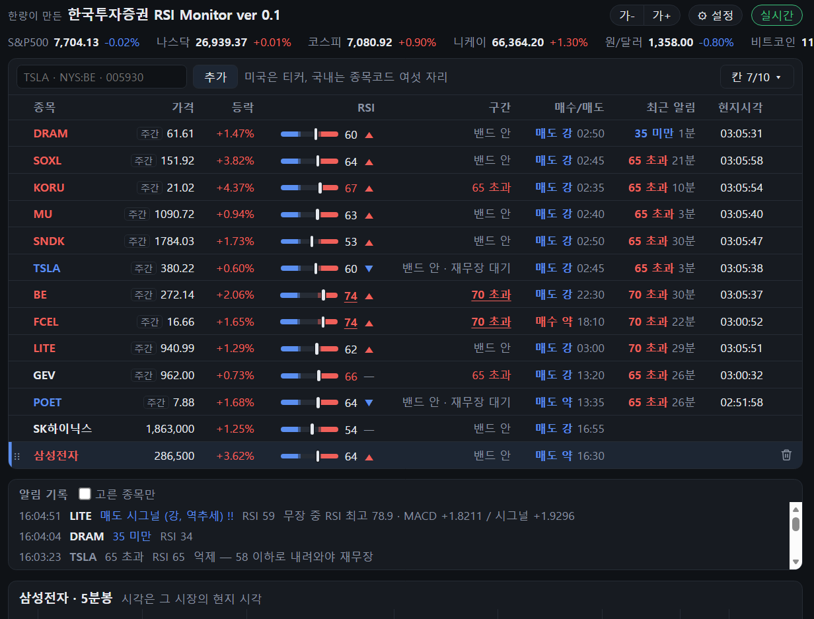

# KoreaInvestment RSI Monitor

**한국투자증권 Open API 로 미국·국내 주식 분봉과 실시간 체결가를 받아서, RSI 와 MACD 를 실시간으로 보여준다.**

<sub>Live RSI and MACD for US and Korean stocks, computed from Korea Investment & Securities (KIS) Open API minute bars and trade feed. Korean UI.</sub>

> 한국투자증권과 관계없는 개인 프로젝트다. 한국투자증권이 만들거나 확인한 프로그램이 아니며,
> 한국투자증권 Open API 를 쓸 뿐이다. 투자 판단과 그 결과는 쓰는 사람의 몫이다.



- **1단계 (됨)** — 분봉과 실시간 체결가로 RSI·MACD 를 계산해서 웹 화면에 보여준다.
- **2단계** — [webull_rsi_monitor](https://github.com/destory1984/webull_rsi_monitor) 처럼 선을 넘으면 알린다.
  소리(TTS)는 됐고, 텔레그램은 아직이다.

---

## 왜 만들었나

RSI를 대신 보고 있다가, 적당한 임계를 넘으면 내게 예쁜 목소리로 알려주는 비서가 필요했다.

## 시작하기

### 1. 한국투자증권 키 받기

1. 한국투자증권 계좌를 만든다. 미국 주식을 보려면 한국투자증권 앱에서 **해외주식 거래 신청**도 해 둔다.
2. [KIS Developers](https://apiportal.koreainvestment.com/) 에 들어가 Open API 서비스를 신청하고
   **실전투자** 앱키(App Key)와 시크릿(App Secret)을 받는다. 이 프로그램은 실전투자 주소로만 붙는다.

### 2. 받아서 설치하기

Windows 에 Python 3.11 이상이 있어야 한다.

```bash
git clone https://github.com/destory1984/koreainvestment_rsi_monitor.git
cd koreainvestment_rsi_monitor
pip install -r requirements.txt
```

### 3. 키 넣기

```bash
python kis_rsi.py setup
```

앱키와 시크릿을 물어본다. 토큰을 한 번 받아 보고 맞으면 이 폴더의 `kis_config.json` 에 적는다.
이 파일은 `.gitignore` 에 들어 있어 저장소에 올라가지 않는다. 환경변수 `KIS_APPKEY`, `KIS_APPSECRET` 로 줘도 된다.

### 4. 띄우기

```bash
python kis_web.py TSLA SOXL 005930
```

브라우저가 저절로 http://localhost:8000 을 연다. 다음부터는 종목 없이 `python kis_web.py` 만 하면
저장된 목록으로 뜬다.

### 5. 목소리 (따로 할 것 없음)

알림 목소리는 있는 것 가운데 가장 좋은 것을 저절로 고른다. 2번을 선택하면, 따로 할건 없다.

| 차례 | 목소리 | 필요한 것 |
|---|---|---|
| 1 | 로컬 TTS (Qwen3-TTS 1.7B, 화자 Sohee) | NVIDIA GPU 와 아래 서버. 조금 더 자연스러운 "무료" 목소리 |
| 2 | **Edge 음성** (ko-KR-SunHiNeural, 빠르기 +20%) | 인터넷만. `requirements.txt` 로 이미 깔린다. **대부분은 이것을 쓰면 된다** |

켜면 어느 목소리를 쓰는지 첫 줄에 찍는다(`알림 목소리: Edge 음성 …`). 알림 문장은 켤 때와 종목을 더할 때
미리 wave 파일로 만들어서 `tts_cache/` 에 쌓아 두고, 그 뒤로는 파일만 튼다.

Edge 음성은 Microsoft Edge 브라우저의 「소리 내어 읽기」가 쓰는 음성을 빌려 쓰는 것이라(`edge-tts` 꾸러미),
정식 서비스가 아니어서 언젠가 막힐 수도 있다. 막히면 윈도우에 들어 있는 TTS로 읽는다.

**로컬 TTS 를 쓰려면** — NVIDIA GPU 에 VRAM 이 8GB 남짓 비어 있어야 한다. 모델(약 4.3GB)은 처음 켤 때
Hugging Face 에서 저절로 받는다. 공개 모델이라 토큰은 필요 없다.
필자처럼 사람 목소리에 예민한 사람만 로컬 TTS 를 쓰면 된다. 대부분은 그냥 Edge 음성을 쓰면 된다.

```bash
python -m venv .venv_tts
.venv_tts/Scripts/pip install torch --index-url https://download.pytorch.org/whl/cu124
.venv_tts/Scripts/pip install qwen-tts soundfile
.venv_tts/Scripts/python tts_server.py
```

`준비됨: http://127.0.0.1:47650` 이 나오면 된 것이다. 이 창을 켜 둔 채 다른 창에서 `python kis_web.py` 를 띄운다.

## 인터넷에 띄우지 않는 이유

이 화면을 서버 하나에 띄워 두고 여러 사람이 들어와 보게 할 수도 있다. 기술로는 어렵지 않다.
그래도 그렇게 하지 않고 각자 자기 키로 돌리게 했다. 이유는

1. **남에게 증권사 시세를 보여 주면 안 된다.** 한국투자증권 Open API 는 계좌 주인이 자기 투자에 쓰라고 주는 것이다.
   받은 시세를 다른 사람에게 보여 주는 건 약관으로 막혀 있다. 거래소(나스닥·NYSE·KRX)의
   실시간 시세를 남에게 보여 주려면 원래 따로 돈을 내고 재배포 계약을 맺어야 한다. 몇 사람만 보는
   작은 사이트라도 마찬가지다.

같은 집 안에서 휴대폰으로 보는 것은 `--host 0.0.0.0` 으로 된다(아래 참고).

## 쓰는 법

### 웹 화면

```bash
python kis_web.py TSLA SOXL 005930      # 처음 한 번 종목을 적어 띄운다
python kis_web.py                       # 다음부터는 저장된 목록으로 뜬다
```

브라우저에서 http://localhost:8000 을 연다. 위에는 종목 표, 아래에는 고른 종목의 5분봉 차트와
RSI·MACD 가 나온다. 표에서 종목을 누르면 차트가 바뀐다. 값은 체결이 올 때마다 0.5초 간격으로 고쳐진다.

- **지수 띠** — 제목 아래 한 줄에 S&P500 · 나스닥 종합 · 코스피 · 원/달러 · 비트코인 · 니케이의
  값과 등락률을 보여 준다. 지수는 실시간으로 밀어 주는 통로가 없어 10초마다 묻는다. 비트코인은
  한국투자증권에 없어서 업비트 공개 시세(원화, 키 없음)를 쓴다. 다우존스는 한국투자증권 코드를 찾지 못해 뺐다.
  맨 앞에는 미국·한국 장 상태(주간거래·프리장·정규장·애프터·휴장 / 장전·정규장·장후 시간외·장 마감)와 남은 시간이 나온다.
  시각만으로 가르니 공휴일 휴장은 모른다.
- **종목 더하기·빼기** — 표 위 칸에 적고 추가를 누른다. 미국은 `TSLA`, 거래소를 정하려면 `NYS:BE`,
  국내는 종목코드 여섯 자리(`005930`)다. 줄에 마우스를 올리면 오른쪽 끝에 휴지통이 나온다.
  왼쪽 끝 손잡이(⋮⋮)를 끌면 줄 차례가 바뀐다.
  표 오른쪽 위 「칸 ▾」에서 보일 칸을 고른다. 고른 것은 그 브라우저에만 기억돼서 PC 와 휴대폰을 따로 맞출 수 있다.
  글자 크기는 위의 「가-」「가+」로 9~18px 사이에서 바꾼다. 이것도 브라우저마다 따로 기억한다.
  목록은 `kis_watchlist.json` 에 저장돼서 서버를 다시 켜도 남는다. 40개까지 된다.
- **소리 알림** — RSI 가 35/65 를 넘으면 말머리 소리(땡) 뒤에 「테슬라 65 초과」, 30/70 을 넘으면
  세 음 경보 뒤에 「테슬라 70 초과」를 읽는다. 알림은 서버가 판정하고 이 PC 스피커로 내니 브라우저를
  닫아도 울린다. 한 번 울리면 선에서 7 만큼 되돌아오기 전에는, 그리고 10분 안에는 같은 알림을 다시 내지 않는다.
  규칙과 목소리는 [webull_rsi_monitor](https://github.com/destory1984/webull_rsi_monitor) 와 같다 (`kis_alert.py`).
  위의 「⚙ 설정」의 「RSI 선 알림」으로 끄고 켜고 (끄면 시그널 소리도 안 난다), 「TTS 테스트」로 한 번 들어 본다. 소리가 꺼져 있으면 설정 버튼에 🔇 가 붙는다. 울린 것과 억제된 것은 표 아래 「알림」에 쌓인다.
  소리는 Windows 에서만 난다.
- **목소리** — 로컬 TTS 가 있으면 그것, 없으면 Edge 음성을 쓴다 ([5. 목소리](#5-목소리-따로-할-것-없음)).
  로컬 TTS 서버 주소가 다르면 환경변수 `KIS_TTS_URL` 로 준다. 캐시 파일 이름이 webull_rsi_monitor 와
  같은 규칙이라, `--tts-cache` 로 그쪽 `tts_cache` 를 주면 만들어 둔 소리를 같이 쓴다.
- **매수·매도 시그널** — 봉이 닫힐 때마다 [webull_rsi_monitor](https://github.com/destory1984/webull_rsi_monitor) 의
  `rsi_signal.py` 와 같은 규칙으로 본다 (`kis_signal.py`). RSI 가 35 이하(65 이상)로 가면 12봉 동안 매수(매도)
  쪽을 무장하고, 그동안 MACD 히스토그램이 음→양(양→음)으로 바뀌면 시그널을 낸다. 무장 중 RSI 가 30/70 까지
  갔으면 「강」, 아니면 「약」이다. 봉 안 RSI 최저·최고는 봉의 저가·고가로 정확히 계산한다.
  표의 「매수/매도」 칸에 마지막 시그널과 그 봉 시각이, 차트에는 ▲매수 ▼매도 가 붙는다.
  「테슬라 매수 시그널」처럼 말로도 알린다 (「⚙ 설정」의 「매수·매도 시그널」로 끄고 켠다).
  2026-09-24 장중 11종목에서 Webull 버전이 낸 시그널 15개 가운데 13개가 같은 봉·같은 방향으로 나왔다.
- **알림 기록** — 울린 알림과 억제된 알림이 표 아래 「알림 기록」에 쌓이고 `kis_alerts.jsonl` 에 남아
  서버를 다시 켜도 보인다. 「고른 종목만」을 켜면 차트에 띄운 종목 것만 보인다.
  표의 「구간」은 지금 RSI 가 어느 선 밖인지, 「최근 알림」은 그 종목에서 마지막으로 울린 알림과 지난 시간이다.
  차트에는 알림이 난 봉에 표시가 붙는다 (초과는 봉 위 ▼, 미만은 봉 아래 ▲).
- **시작 인사** — 켤 때 「모니터링을 시작합니다」라고 한다. `kis_settings.json` 에
  `{"greeting": "...", "greeting_again": "..."}` 로 바꾸고, 빈 문자열이면 인사하지 않는다.
- **RSI 옆 ▲▼** — 앞 봉이 닫힐 때의 RSI 보다 0.05 넘게 오르면 ▲, 내리면 ▼ 다.

- 서버 하나가 한국투자증권 실시간 연결을 잡고 브라우저 여러 개에 나눠 준다. 탭을 여러 개 열어도 된다.
- 연결이 끊기면 5초 뒤 다시 붙고, 그 사이 놓친 체결을 메우려고 분봉을 새로 받는다.
- `--host 0.0.0.0` 으로 띄우면 같은 공유기에 붙은 휴대폰에서 `http://PC주소:8000` 으로 볼 수 있다.
  비밀번호가 없으니 밖에서 들어올 수 있는 망에서는 쓰지 말 것.

### 분봉

```bash
python kis_rsi.py bars TSLA SOXL        # 5분봉, 최근 20개를 보여준다
python kis_rsi.py bars TSLA --min 1     # 1분봉
python kis_rsi.py bars NYS:BE -n 50     # 거래소를 직접 적기, 50개 보여주기
python kis_rsi.py bars TSLA --today     # 전날 봉은 빼기
```

한 번에 최근 120개까지 받는다. 5분봉이면 미국 시각 새벽 5시 프리장부터 지금까지 정도다.

### 실시간 체결가

```bash
python kis_rsi.py live TSLA SOXL FCEL
```

체결될 때마다 한 줄씩 찍는다. Ctrl+C 로 끝낸다.

```
04:04:59  TSLA     379.0700   -0.28%  체결   3000  누적 16040917  (미국 150505)
04:04:59  SOXL     145.2900   -0.66%  체결   1066  누적 29647825  (미국 150505)
```

한국 낮 시간의 주간거래는 `--prefix R` 로 받는다. 이때는 거래소 코드가 `BAQ`(나스닥),
`BAY`(뉴욕), `BAA`(아멕스) 라서 `BAQ:TSLA` 처럼 적어야 한다.
웹 화면(`kis_web.py`)은 주간거래 시간(미국 동부 20:00~04:00)이 되면 저절로 주간거래 쪽으로 바꿔 받는다.
주간거래 체결가일 때는 가격 앞에 「주간」이 붙는다.

RSI·차트에 주간거래(오버나이트) 봉을 넣을지는 Webull 을 따른다. Webull 은 인기 종목만 24시간 거래를 해 주고
그 종목만 5분봉에 오버나이트 봉을 넣는다 (MU 는 넣고 FCEL 은 안 넣는다). 그 목록을 알 길이 없어서,
최근 오버나이트 5분 칸 절반 넘게 체결이 있었으면 넣고 아니면 뺀다. RSI 옆에 「24h」(넣음) 나 「정규」(뺌) 가 붙고,
누르면 표 위 알림 줄에 까닭이 나오고 거기서 바꿀 수 있다. 손으로 바꾼 것은 파랗게 보이고 `kis_settings.json` 에 남는다.

### RSI · MACD 표

```bash
python kis_rsi.py watch TSLA SOXL MU
```

종목마다 한 줄씩 표를 띄워 두고 체결이 올 때마다 고친다. RSI 가 30 이하면 파랗게, 70 이상이면
빨갛게 칠한다 (`--lower`, `--upper` 로 바꾼다). MACD 히스토그램은 양수면 초록, 음수면 빨강이다.

```
┌──────┬───────────┬──────┬───────┬─────────┬─────────┬─────────┬──────────┐
│ 종목 │      가격 │ 등락 │   RSI │    MACD │  시그널 │  히스토 │ 미국시각 │
├──────┼───────────┼──────┼───────┼─────────┼─────────┼─────────┼──────────┤
│ TSLA │  379.5600 │-0.13%│ 50.26 │ -0.1509 │ -0.1020 │ -0.0489 │ 15:20:13 │
│ SOXL │  145.9265 │+0.02%│ 59.68 │ +0.6265 │ +0.5696 │ +0.0569 │ 15:20:13 │
└──────┴───────────┴──────┴───────┴─────────┴─────────┴─────────┴──────────┘
```

Git Bash 에서 표가 깨지면 `winpty python kis_rsi.py watch ...` 로 실행한다.

### RSI · MACD 줄 단위

```bash
python kis_rsi.py rsi TSLA SOXL             # 바뀔 때마다 한 줄씩
python kis_rsi.py rsi TSLA --once           # 분봉 값만 보고 끝내기
python kis_rsi.py rsi TSLA --min 1 --period 9
```

RSI 가 0.1 이상 바뀌거나 MACD 히스토그램 부호가 바뀔 때만 찍는다 (`--step` 으로 바꾼다).

### 알림 채점 (되감기)

```bash
python kis_replay.py                  # 종목 목록의 미국 종목 전부, 8거래일
python kis_replay.py TSLA --days 15
python kis_replay.py --by 세션         # 프리·정규·애프터·주간 따로 (--by 종목 도 된다)
python kis_replay.py --list           # 하나씩 다 보기
python kis_replay.py --csv scored.csv
```

지난 며칠 5분봉을 받아 웹 화면과 **같은 규칙**으로 35/65·30/70 알림과 매수·매도 시그널을 다시 내 보고,
그 뒤 15·30·60분에 가격이 RSI 가 말한 쪽(미만·매수는 오름, 초과·매도는 내림)으로 갔는지 센다.
「기준」은 아무 봉에서나 같은 쪽으로 들어갔을 때의 평균이고, 「초과」가 그것을 뺀 값이다. 0 근처면 값어치가 없다.

받은 분봉은 `replay_cache/` 에 쌓인다. 한국투자증권은 주간거래 분봉을 지금 세션 것만 주니,
오버나이트 알림은 되감을 때마다 조금씩 쌓인다. 국내 종목은 아직 되감지 않는다.

### 어떻게 계산하나

분봉 120개로 값을 잡아 두고, 체결이 올 때마다 진행 중인 봉의 종가를 바꿔서 다시 계산한다.
시간이 다음 봉으로 넘어가면 새 봉을 붙인다.

- **RSI** — Webull 등 대부분의 차트와 같은 와일더 방식이다. 처음 14개는 오른 폭·내린 폭을
  산술평균하고, 그 뒤로는 `(앞 평균 × 13 + 이번 값) / 14` 로 이어 간다.
- **MACD** — 12·26 봉 지수이동평균의 차이가 MACD 선, 그 9봉 지수이동평균이 시그널,
  둘의 차이가 히스토그램이다. Webull 은 히스토그램을 두 배로 그리기도 하는데 부호는 같다.

프리장 봉도 들어가니, 차트에서 연장 거래 시간을 켜 둔 것과 견줘야 값이 맞는다.

### Webull 과 얼마나 맞나

2026-09-24 미국 장중 15:15~15:27 에 11종목을 Webull 화면과 같은 순간에 견줬다 (66건).
Webull 값은 [webull_rsi_monitor](https://github.com/destory1984/webull_rsi_monitor) 가 화면에서 읽은 것이다.

| 차이 | 건수 |
|---|---|
| 0.5 이내 | 51건 (77%) |
| 1 이내 | 61건 (92%) |
| 가장 큼 | 1.78 |

중앙값은 0.18 이다. 크게 벌어진 건 대부분 거래가 뜸한 종목이거나, 화면 캡처와 체결 사이
몇 초 동안 가격이 움직인 경우다.

## 알아둘 것

- **국내 종목은 1분봉을 모아 5분봉을 만든다.** 국내 분봉 API 는 1분봉만 한 번에 120개씩 주기 때문이다.
  분봉에는 넥스트레이드 애프터마켓(~20:00)까지 들어오지만, 실시간 체결은 KRX(H0STCNT0)만 받는다.
- **런던·독일 상장 종목(DRM3 같은 것)은 안 된다.** 한국투자증권 해외 시세는 미국·홍콩·중국·일본·베트남만 준다.
- **실시간 연결은 앱키 하나에 하나뿐이다.** `watch` 를 켜 둔 채 다른 창에서 `live` 나 `rsi` 를 켜면
  `ALREADY IN USE appkey` 로 거절된다. 종목은 한 연결에 여러 개 넣으면 된다.
- **거래소는 알아서 찾는다.** 종목만 적으면 나스닥 → 뉴욕 → 아멕스 순서로 찾아보고
  `kis_exchange.json` 에 적어 둔다. 한 번 찾은 종목은 다시 찾지 않는다.
- **접근토큰은 24시간 쓴다.** 새 토큰은 1분에 한 번만 받을 수 있어서 `kis_token.json` 에
  두고 다시 쓴다.
- **실시간 데이터는 맨 앞에 구독 키가 한 칸 더 붙어 온다.** 공식 예제의 필드 목록에는 이 칸이
  빠져 있어서, 그대로 쓰면 값이 한 칸씩 밀린다. 여기서는 `RSYM` 을 맨 앞에 넣어 맞췄다.
- Git Bash 에서도 한글이 깨지지 않게 출력을 UTF-8 로 내보낸다.

## 라이선스

MIT
