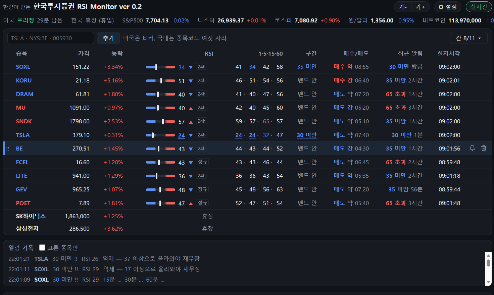

# KoreaInvestment RSI Monitor

**한국투자증권 Open API 로 미국·국내 주식 분봉과 실시간 체결가를 받아서, RSI 와 MACD 를 실시간으로 보여주고 선을 넘으면 알린다.**

<sub>Live RSI and MACD for US and Korean stocks, computed from Korea Investment & Securities (KIS) Open API minute bars and trade feed. Korean UI.</sub>

> 한국투자증권과 관계없는 개인 프로젝트다. 한국투자증권이 만들거나 확인한 프로그램이 아니며,
> 한국투자증권 Open API 를 쓸 뿐이다. 투자 판단과 그 결과는 쓰는 사람의 몫이다.



RSI 를 대신 보고 있다가, 선을 넘으면 목소리로 알려 주는 비서가 필요해서 만들었다.

## 하는 일

- 미국·국내 종목 40개까지 RSI(14)·MACD(12, 26, 9)를 5분봉으로 셈하고, 체결이 올 때마다 0.5초 간격으로 고친다.
- RSI 가 35/65 를 넘으면 「테슬라 65 초과」처럼 PC 스피커로 읽고, 30/70 을 넘으면 경보음을 붙인다. 텔레그램으로도 보낸다.
- RSI 가 선 밖으로 나갔다가 돌아오면 매수·매도 시그널을 낸다.
- 1·5·15·60분봉 RSI 를 한 줄에 나란히 보인다.
- 한국 낮에 열리는 미국 주간거래(미국 동부 20:00 → 04:00)도 받는다.
- 울린 알림마다 15·30·60분 뒤 가격을 붙이고, 지난 분봉을 되감아 알림이 맞았는지 채점한다.

## 시작하기

Windows 와 Python 3.11 이상이 필요하다.

1. 한국투자증권 계좌를 만들고, 미국 주식을 보려면 앱에서 해외주식 거래 신청을 한다.
2. [KIS Developers](https://apiportal.koreainvestment.com/) 에서 **실전투자** 앱키와 시크릿을 받는다.
3. 받아서 설치한다.

   ```bash
   git clone https://github.com/destory1984/koreainvestment_rsi_monitor.git
   cd koreainvestment_rsi_monitor
   pip install -r requirements.txt
   ```

4. 키를 넣는다. `kis_config.json` 에 적히고 이 파일은 저장소에 올라가지 않는다.
   환경변수 `KIS_APPKEY`, `KIS_APPSECRET` 로 줘도 된다.

   ```bash
   python kis_rsi.py setup
   ```

5. 띄운다. 브라우저가 http://localhost:8000 을 연다.

   ```bash
   python kis_web.py TSLA SOXL 005930
   ```

다음부터는 `python kis_web.py` 만 하면 저장된 목록으로 뜬다. 끌 때는 `python kis_web.py --stop`.

## 화면

- **종목** — 표 위 칸에 `TSLA`, `NYS:BE`, `005930`(국내는 종목코드 여섯 자리)처럼 적고 추가를 누른다. 줄을 누르면 아래 차트가 그 종목으로 바뀐다.
- **⚙ 설정** — 소리 끄고 켜기, 세션마다 다른 RSI 선, 조용한 시각, 목소리 크기, 텔레그램.
- **24h / 정규** — RSI 옆 표시다. 「24h」는 주간거래 봉을 넣어 셈한 값이고 「정규」는 뺀 값이다.
  증권사 차트와 값이 다르면 이것을 눌러 바꾼다.
- **알림 기록 · 성적** — 표 아래에 울린 알림과 그 뒤 결과가 쌓인다.

## 알림 규칙

| 알림 | 언제 |
|---|---|
| 35 미만 · 65 초과 | RSI 가 선을 넘을 때. 말머리 소리 뒤에 읽는다 |
| 30 미만 · 70 초과 | 세 음 경보 뒤에 읽는다 |
| 매수 · 매도 시그널 | RSI 가 35 이하(65 이상)로 갔다가 12봉 안에 선 안으로 돌아온 봉이 닫힐 때 |

같은 알림은 RSI 가 선에서 7 만큼 되돌아오기 전에는, 그리고 10분 안에는 다시 울리지 않는다.
선은 세션(주간거래·프리·정규·애프터·국내)마다 따로 정할 수 있다.

목소리는 Edge 음성을 쓴다 (인터넷만 있으면 된다). NVIDIA GPU 가 있으면 로컬 TTS 로 바꿀 수 있다.

## 명령

| 명령 | 하는 일 |
|---|---|
| `python kis_web.py` | 웹 화면. `--stop` 끄기, `--host 0.0.0.0` 같은 공유기의 휴대폰에서 보기 |
| `python kis_rsi.py bars TSLA` | 분봉 보기 |
| `python kis_rsi.py live TSLA` | 실시간 체결가를 한 줄씩 |
| `python kis_rsi.py watch TSLA` | 터미널에 RSI·MACD 표 |
| `python kis_replay.py` | 지난 분봉으로 알림 채점. `--collect` 는 분봉을 DB 에 쌓기만 한다 |
| `python kis_tf.py` | 몇 분봉 RSI 가 잘 맞는지 견주기 |
| `python kis_report.py --open` | 채점 보고서 한 페이지 |
| `python -m unittest discover tests` | 규칙 시험 (92개, 1초 안) |

## 알아둘 것

- **실시간 연결은 앱키 하나에 하나다.** 서버가 떠 있으면 `live`·`watch`·`rsi` 는 거절된다.
- **인터넷에 올려 여럿이 보게 하면 안 된다.** 받은 시세를 남에게 보여 주는 것은 약관으로 막혀 있다. 각자 자기 키로 돌린다.
- **국내 종목은 KRX 정규장(09:00 → 15:30)만 쓴다.** 넥스트레이드 시간까지 보려면 설정에서 켠다.
- **런던·독일 상장 종목은 안 된다.** 한국투자증권 해외 시세는 미국·홍콩·중국·일본·베트남만 준다.
- **소리는 Windows 에서만 난다.**
- **Webull 화면과 견주면** 11종목 66건에서 RSI 차이의 중앙값이 0.18 이고 92% 가 1 이내였다 (2026-09-24).

## 더 자세히

[docs/manual.md](docs/manual.md) 에 있다: 로그인할 때 저절로 띄우기, 로컬 TTS 깔기, 화면의 칸과 설정 하나하나,
채점 도구 쓰는 법, 분봉 모으기, RSI·MACD 셈법.

## 라이선스

MIT
